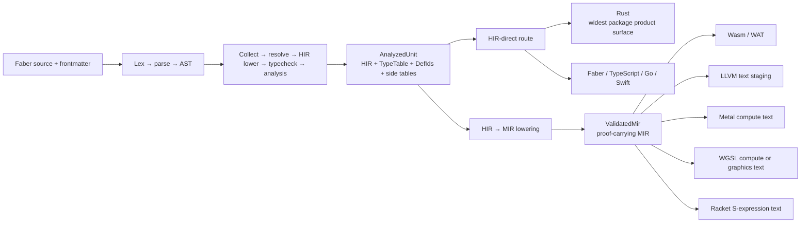
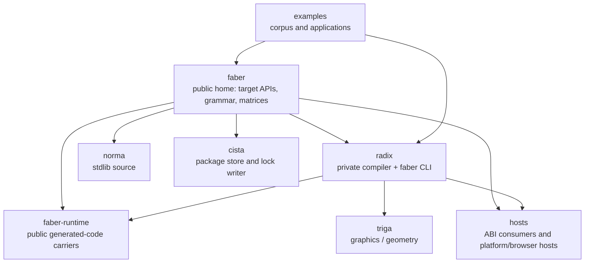

# Faber

A statically typed compute language with **reader-localized source** and
**measured multi-target lowering** — one semantic program, readable in your
language, portable across compilation and device paths.

Faber programs are written once and rendered in any of eight reader locales
(English, Latin, Arabic, Hindi, Vietnamese, Thai, Simplified Chinese,
Traditional Chinese) without changing meaning. The same analyzed program feeds
application targets (Rust, TypeScript, Go, Swift, Faber) or device programs
(Metal, CUDA). Every target is a **projection** of HIR meaning — support is
stated target by target, never assumed.

This repository is the language project home and the source home for Faber's
generated-language support packages. The compiler and `faber` CLI implementation
are maintained in a private repository (Radix). Public binaries, checksums,
grammar, examples, and target APIs remain available here and across the
repository family.

## Install

Supported release archives are published at
[faberlang/releases](https://github.com/faberlang/releases/releases).

```sh
# Select the current version and platform archive from the releases page.
tar -xzf faber-vX.Y.Z-<target>.tar.gz
./bin/faber --version
```

Each archive ships a `bin/` and a `share/` tree — keep them together so the
reader packs resolve beside the binary. Package acquisition is owned by
[Cista](https://github.com/faberlang/cista); the `faber` CLI consumes the
resulting project lock. Step-by-step:
[Install guide](https://faberlang.dev/en-US/start/install.html).

## Status

| Tier | What is true |
| --- | --- |
| **Shipped** | Reader-localized source, diagnostics, and formatting. |
| **Proven now** | Bounded dual-backend device training on Metal and CUDA (device-resident steps with gradient mapping and numeric comparison on an accepted MLP path). |
| **Building next** | Faber-owned GPU inference behind a pinned model contract and correctness oracle (CPU oracle stack exists; end-to-end device inference is not shipped). |
| **Frontier** | Multi-device execution, virtual GPUs, sharding, and distributed training or serving. |

## Quick start

```text
functio divide(numerus a, numerus b) → numerus ∪ nihil {
    si b ≡ 0 ergo redde nihil
    redde a / b
}
```

```sh
faber check .          # typecheck
faber run .            # build + run
faber test .           # run probanda
faber explain <term>   # reference pack for a grammar term
```

The full start track — hello world, daily commands, first package — is on the
[documentation site](https://faberlang.dev/en-US/start/).

## Compilation model



HIR is the semantic authority; each target emits, validates, runs, or remains
limited on its own terms. The full picture — including the reverse-AD (AIR)
lane, the MIR stepper, and the package workflow — is in
[`docs/architecture.md`](docs/architecture.md).

### Target support

Measured lowerability across the exempla corpus (from
[`docs/EBNF_MATRIX.md`](docs/EBNF_MATRIX.md), re-rendered at each release from
the radix measurement):

| Lane | Targets | Support |
| --- | --- | --- |
| Application (HIR) | Rust · Go · TypeScript · Faber | 99% · 92% · 100% · 100% |
| Systems (MIR) | llvm-text · wasm-text · sexp · scena | 99% · 92% · 79% · 86% |
| Device kernels | Metal · WGSL | measured against the kernel surface, not the general corpus |

Full per-term tables: [grammar × target support](docs/EBNF_MATRIX.md) ·
[conversion (`↦`) coverage](docs/CONVERSIO_MATRIX.md).

## Grammar

The formal grammar is [`docs/EBNF.md`](docs/EBNF.md) — the canonical
specification, with one production per construct and spec commentary. The
rendered, localized grammar is published on
[the documentation site](https://faberlang.dev/en-US/reference/grammar.html).

## Target APIs

| Target | Public source | Package identity |
| --- | --- | --- |
| Rust | [`runtime/rust/`](runtime/rust/) | package `faber-runtime`, crate `faber` |
| TypeScript | [`runtime/typescript/`](runtime/typescript/) | `@faber/runtime` |
| Go | [`runtime/go/`](runtime/go/) | `faber/rt` |
| Swift | [`runtime/swift/`](runtime/swift/) | `FaberRuntime` |

The Rust ABI and carrier sources are under
[`runtime/rust/src/contract/`](runtime/rust/src/contract/). Concrete
filesystem, process, network, browser, LLVM, and device behavior belongs in
Hosts, not these generated-language packages.

The [HTTP package](packages/http/) and
[Rust HTTP transport](crates/http-transport/) are also public here.

## Repository map



| Repository | Role | Visibility |
| --- | --- | --- |
| `faberlang/faber` | Language home, target APIs, grammar, matrices | Public |
| `faberlang/releases` | Signed release objects and checksums | Public |
| `faberlang/norma` | Standard library source | Public |
| `faberlang/cista` | Package store and lock writer | Public |
| `faberlang/hosts` | Concrete host implementations | Public |
| `faberlang/examples` | Examples and application packages | Public |
| `faberlang/tree-sitter-faber` | Editor grammar | Public |
| `faberlang/faberlang.dev` | Documentation site | Public |
| Radix | Compiler and `faber` CLI implementation | Private |

The machine-readable form is [`catalog.json`](catalog.json).

## Documentation

- [faberlang.dev](https://faberlang.dev/en-US/) — the documentation site:
  start, language, toolchain, libraries, reference
- [`docs/EBNF.md`](docs/EBNF.md) — formal grammar
- [`docs/EBNF_MATRIX.md`](docs/EBNF_MATRIX.md) — grammar × target support matrix
- [`docs/CONVERSIO_MATRIX.md`](docs/CONVERSIO_MATRIX.md) — conversion coverage matrix
- [`docs/architecture.md`](docs/architecture.md) — compilation model and ecosystem diagrams

## Issues And Contributions

Use this repository for language reports, public target-package bugs, and
documentation routing. Compiler implementation patches cannot be accepted
because that source is private. Reproducible reports should include the Faber
version, target, source fixture, exact command, and observed output.

Public package changes are accepted when they preserve the generated-code
contract and include focused tests. See
[`docs/CONTRIBUTING.md`](docs/CONTRIBUTING.md).

Report security issues through
[GitHub private vulnerability reporting](https://github.com/faberlang/faber/security/advisories/new),
not a public issue.

## History

Older compiler and CLI source remains available in this repository's Git
history. It is historical, not the current implementation.

## License

MIT. See [`LICENSE`](LICENSE).
