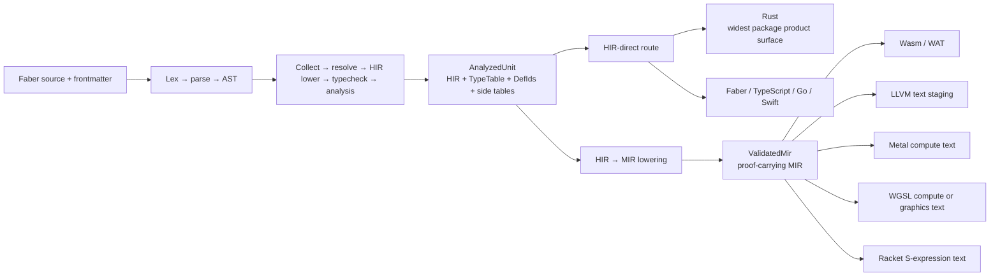
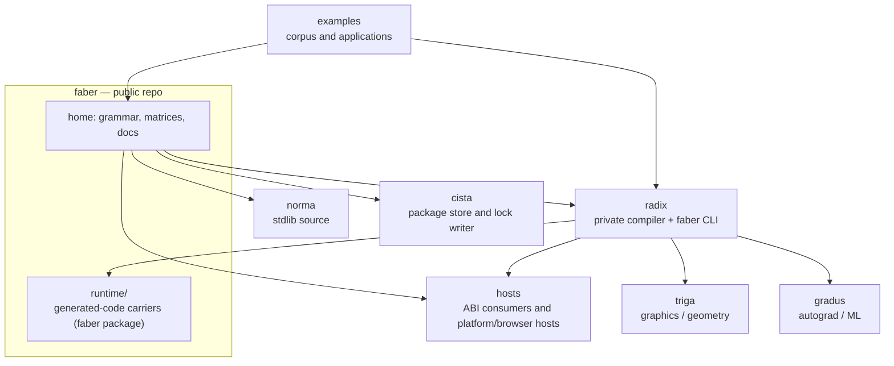

# Faber

A statically typed compute language designed for **coding agents and human
authors**. Write one semantic program; read it in your language; build it for
the target you need.

Meaning lives in a high-level intermediate representation (HIR). Source
renderings, diagnostics, and generated code are projections of that one
program — a single semantic core for agents to analyze, and a stable
target-by-target story for humans to reason about.

Agent-authored code is a first-class audience. This repository is built to be
read by machines: [`llms.txt`](llms.txt) is the machine-readable entry point,
and the documentation site publishes an
[agent guide](https://faberlang.dev/agents/index.md) and installable
[agent skills](https://faberlang.dev/.well-known/agent-skills/).

This repository is the language project home and the source home for Faber's
generated-language support packages. The compiler and `faber` CLI implementation
are maintained in a private repository (Radix), closed-source while in
development. Public binaries, checksums, grammar, examples, and target APIs
remain available here and across the repository family.

## Why Faber

- **One semantic program.** Write the program once. Reader locales and codegen
  targets are projections of the same analyzed unit — meaning never forks per
  reader or per target.
- **HIR is the meaning.** Source lowers to an HIR that owns semantics; each
  target is a projection of it. Support is measured and stated target by
  target, never assumed.
- **Read it in your language.** Source is reader-localized, not translated:
  English is the default authoring surface, and the same program renders in
  Latin, Arabic, Hindi, Vietnamese, Thai, Simplified Chinese, and Traditional
  Chinese without changing meaning.
- **Type-first and tensor-native.** Declarations are type-first — `int a`, not
  `a: int`. Nullability is an explicit union (`T ∪ null`). Tensor operations
  are first-class glyphs: `·` matrix multiplication, `⊗` outer product,
  `⊙` Hadamard product.

Tensor shapes are first-class citizens:

```faber
main {
    const vf32[3] a ← [1.0, 2.0, 3.0] ↦ vf32[3]
    const vf32[2] p ← [1.0, 1.0] ↦ vf32[2]
    const vf32[4] s ← [1.0, 2.0, 3.0, 4.0] ↦ vf32[4]
    const matrix<f32, [3, 2]> left ← a ⊗ p
    const matrix<f32, [2, 4]> right ← p ⊗ s
    const matrix<f32, [3, 4]> product ← left · right
    print product
}
```

## Quick start

```faber
fn divide(int a, int b) → int {
    guard {
        if b ≡ 0 {
            return 0
        }
    }
    return a / b
}

main {
    print divide(10, 2)
    print divide(10, 0)
}
```

```sh
faber check .          # typecheck
faber run .            # build + run
faber test .           # run probanda
faber explain <term>   # reference pack for a grammar term
```

The full start track — hello world, daily commands, first package — is on the
[documentation site](https://faberlang.dev/en-US/start/).

## For coding agents

- [`llms.txt`](llms.txt) — this repository's machine-readable index
- [Agent guide](https://faberlang.dev/agents/index.md) — an agent-facing
  walkthrough of the language
- [Agent skills](https://faberlang.dev/.well-known/agent-skills/index.json) —
  installable skills for install, language, and examples
- [`docs/EBNF.md`](docs/EBNF.md) — the formal grammar, one production per
  construct

## Status

The **v1 series is experimental**: the language and toolchain are under active
development, and surfaces may change between releases.

| Tier | What is true |
| --- | --- |
| **Shipped** | Reader-localized source, diagnostics, and formatting. |
| **Proven now** | Bounded dual-backend device training on Metal and CUDA (device-resident steps with gradient mapping and numeric comparison on an accepted MLP path). |
| **Building next** | Faber-owned GPU inference behind a pinned model contract and correctness oracle (CPU oracle stack exists; end-to-end device inference is not shipped). |
| **Frontier** | Multi-device execution, virtual GPUs, sharding, and distributed training or serving. |

## Install

Release archives are published at
[faberlang/releases](https://github.com/faberlang/releases/releases). The
current release is **faber-v1.8.0**:

```sh
# Pick the archive for your platform from the release page.
tar -xzf faber-v1.8.0-<target>.tar.gz
./bin/faber --version
```

Published targets: `aarch64-apple-darwin`, `x86_64-unknown-linux-gnu`, each
with a `.sha256` checksum.

Each archive ships a `bin/` and a `share/` tree — keep them together so the
reader packs resolve beside the binary. Package acquisition is owned by
[Cista](https://github.com/faberlang/cista); the `faber` CLI consumes the
resulting project lock. Step-by-step:
[Install guide](https://faberlang.dev/en-US/start/install.html).

## Next steps

- **Write real Faber now** — [Gradus](https://github.com/faberlang/gradus) is
  the open autograd and ML library: gradients, loss functions, optimizers,
  neural-network primitives, and training mechanics in public Faber source.
- **Learn the language** — [faberlang.dev](https://faberlang.dev/en-US/) is
  the documentation site: start, language, toolchain, libraries, reference.
- **Bring an agent** — point it at [`llms.txt`](llms.txt), the agent guide,
  and the agent skills.

## Compilation model



HIR is the semantic authority; each target emits, validates, runs, or remains
limited on its own terms. The full picture — including the reverse-AD (AIR)
lane, the MIR stepper, and the package workflow — is in
[`docs/architecture.md`](docs/architecture.md).

### Target support

Measured lowerability across the exempla corpus (from
[`docs/EBNF_MATRIX.md`](docs/EBNF_MATRIX.md), re-rendered at each release from
the radix measurement):

| Lane | Targets | Support |
| --- | --- | --- |
| Application (HIR) | Rust · Go · TypeScript · Faber | 99% · 92% · 100% · 100% |
| Systems (MIR) | llvm-text · wasm-text · sexp · scena | 99% · 92% · 79% · 86% |
| Device kernels | Metal · WGSL | measured against the kernel surface, not the general corpus |

Full per-term tables: [grammar × target support](docs/EBNF_MATRIX.md) ·
[conversion (`↦`) coverage](docs/CONVERSIO_MATRIX.md).

## Grammar

The formal grammar is [`docs/EBNF.md`](docs/EBNF.md) — the canonical
specification, with one production per construct and spec commentary. The
rendered, localized grammar is published on
[the documentation site](https://faberlang.dev/en-US/reference/grammar.html).

## Target APIs

| Target | Public source | Package identity |
| --- | --- | --- |
| Rust | [`runtime/rust/`](runtime/rust/) | package `faber`, crate `faber` |
| TypeScript | [`runtime/typescript/`](runtime/typescript/) | `@faber/runtime` |
| Go | [`runtime/go/`](runtime/go/) | `faber/rt` |
| Swift | [`runtime/swift/`](runtime/swift/) | `FaberRuntime` |

The Rust ABI and carrier sources are under
[`runtime/rust/src/contract/`](runtime/rust/src/contract/). Concrete
filesystem, process, network, browser, LLVM, and device behavior belongs in
Hosts, not these generated-language packages.

The [HTTP package](packages/http/) and
[Rust HTTP transport](crates/http-transport/) are also public here.

## Repository map



| Repository | Role | Visibility |
| --- | --- | --- |
| `faberlang/faber` | Language home, target APIs, grammar, matrices | Public |
| `faberlang/releases` | Signed release objects and checksums | Public |
| `faberlang/norma` | Standard library source | Public |
| `faberlang/cista` | Package store and lock writer | Public |
| `faberlang/hosts` | Concrete host implementations | Public |
| `faberlang/examples` | Examples and application packages | Public |
| `faberlang/gradus` | Autograd and ML library | Public |
| `faberlang/tree-sitter-faber` | Editor grammar | Public |
| `faberlang/faberlang.dev` | Documentation site | Public |
| Radix | Compiler and `faber` CLI implementation | Private |

The machine-readable form is [`catalog.json`](catalog.json).

## Documentation

- [faberlang.dev](https://faberlang.dev/en-US/) — the documentation site:
  start, language, toolchain, libraries, reference
- [`llms.txt`](llms.txt) — machine-readable entry point for agents
- [`docs/EBNF.md`](docs/EBNF.md) — formal grammar
- [`docs/EBNF_MATRIX.md`](docs/EBNF_MATRIX.md) — grammar × target support matrix
- [`docs/CONVERSIO_MATRIX.md`](docs/CONVERSIO_MATRIX.md) — conversion coverage matrix
- [`docs/architecture.md`](docs/architecture.md) — compilation model and ecosystem diagrams

## Issues And Contributions

Use this repository for language reports, public target-package bugs, and
documentation routing. Compiler implementation patches cannot be accepted
because that source is private. Reproducible reports should include the Faber
version, target, source fixture, exact command, and observed output.

Public package changes are accepted when they preserve the generated-code
contract and include focused tests. See
[`docs/CONTRIBUTING.md`](docs/CONTRIBUTING.md).

Report security issues through
[GitHub private vulnerability reporting](https://github.com/faberlang/faber/security/advisories/new),
not a public issue.

## History

Older compiler and CLI source remains available in this repository's Git
history. It is historical, not the current implementation.

## License

MIT. See [`LICENSE`](LICENSE).
