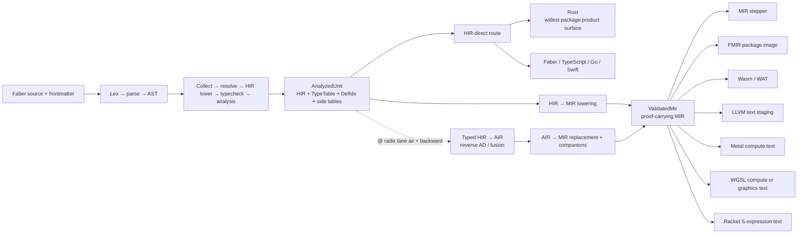
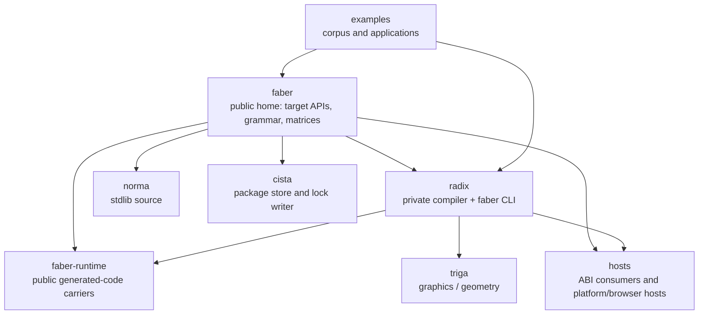
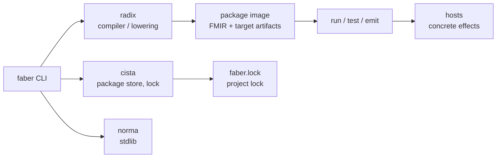

# Faber Architecture

How the pieces fit: the compilation model, the repository ecosystem, and the
package workflow. These diagrams render natively on GitHub; the styled version
of the compilation model also lives on
[the documentation site](https://faberlang.dev/en-US/toolchain/radix.html).

## Compilation model

Faber's intermediate representation is the semantic authority. No target or
human-language surface is privileged: each target is a **projection** of HIR
meaning, and support is measured target by target (see
[`EBNF_MATRIX.md`](EBNF_MATRIX.md)).

Lane split: the **application lane** (HIR) emits source languages; the
**systems lane** (MIR) emits IR and device artifacts. Real device execution
runs through `faber run --backend metal` / `--backend cuda` on the packaged
image — it is not a text-emit product surface.

## Repository ecosystem

`faber/docs/` holds the public grammar ([`EBNF.md`](EBNF.md)) and the generated
target matrices ([`EBNF_MATRIX.md`](EBNF_MATRIX.md),
[`CONVERSIO_MATRIX.md`](CONVERSIO_MATRIX.md)). Radix regenerates the matrices
and gates their freshness against this repository; the documentation site
renders the localized views.

## Package workflow

Package acquisition is owned by [Cista](https://github.com/faberlang/cista);
the `faber` CLI consumes the resulting project lock. Concrete filesystem,
process, network, browser, LLVM, and device behavior belongs in Hosts, not the
generated-language packages.
