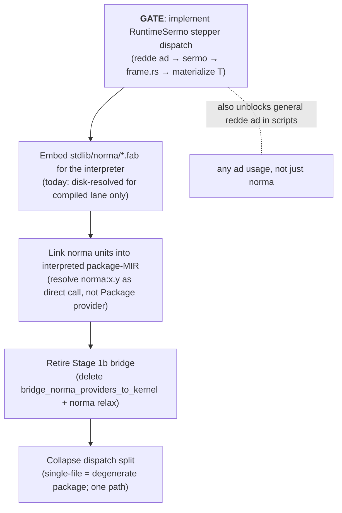

# Scoping: Interpreted `norma:*` Execution Over the Gateway

**Status**: rough scoping (2026-07-06) — for further analysis. **Not a delivery
spec; do not implement from this.**
**Owner campaign**: faber-script-runtime (straddles core-stdlib — see
[Ownership](#ownership)).
**Related**: [`stage1b-package-host-bridge.md`](stage1b-package-host-bridge.md)
(the bridge this would retire),
[`../core-stdlib/CAMPAIGN.md`](../core-stdlib/CAMPAIGN.md) (`ad` materializer
track row).

## Why this doc

Three changes keep coming up together and feel tangled:

1. **Collapse the `faber script` dispatch split** — single-file vs package-MIR.
2. **Make `norma:*` imports execute by loading stdlib source over the in-memory
   gateway (`ad`)**, instead of as opaque providers.
3. **Retire the Stage 1b bridge** (`norma:*` → `faber:*` kernel rewrite).

They are interrelated, but they are **not equally hard, and one of them gates
the rest.** This doc exists to make that legible so the problem can be analyzed
without drowning in the coupling.

**Architectural premise (stated by user):** the single-file case is a subset of
the package case — a degenerate one-unit package. The fact that it is a separate
code path is a flaw ("sound faults"), not a boundary. The target is one path.

## The one gate

**The stepper does not execute `redde ad` (the sermo / `ad` conversation).** It
is classified `Defer` — the single source of truth for stepper dispatch
(`crates/radix/src/mir/stepper/capability.rs`):

```rust
MirRuntimeAbiFamily::RuntimeProvider => StepperDispatchStatus::HostDelegate, // kernel/host — the Stage 1b bridge rides this
MirRuntimeAbiFamily::RuntimeSermo    => StepperDispatchStatus::Defer,        // redde ad — NOT dispatched
// Defer = "Stepper does not yet dispatch; tracked deferred debt (Stage 4 / ad factory)"
```

Every `norma:*` verb body is `redde ad '<route>' ↦ T` (see `stdlib/norma/*.fab`).
So **no norma verb can execute over the gateway until sermo dispatch is
implemented.** The `frame.rs` gateway handlers (`tempus:nunc`, `solum:scribe`,
`runtime:echo`, …) already exist but are **unreachable from the stepper today.**

This is the **same** blocking item flagged independently by:

- core-stdlib's `ad` materializer track row,
- the Stage 1b retire path,
- the in-tree "Stage 4 / ad factory" debt note.

It is **shared deferred debt, not owned by this campaign.**

## Dependency chain



Everything below the gate only produces working norma-over-gateway **once the
gate lands.** The gate is also independently useful (unblocks arbitrary
`redde ad` in user scripts).

## Current state

| Surface | State | Evidence |
| --- | --- | --- |
| Stepper `redde ad` / sermo dispatch | **Deferred (not executed)** | `capability.rs`: `RuntimeSermo => Defer` |
| `frame.rs` gateway route handlers | **Exist, unreachable from stepper** | `crates/faber/src/frame.rs` (`tempus:*`, `solum:*` writes, `runtime:echo`); no-op `_ => {}` for the rest |
| `ad` response materializer (Valor → `T`) | Partial; known type gaps | core-stdlib ledger: octeti write paths, complex genera |
| stdlib `norma:*` source | On disk; analyzed by compiled lane only | no `include_str!` of `stdlib/norma` in interpreter crates |
| `norma:*` import → provider kind | Opaque `Package` provider | `crates/radix/src/mir/lower/context.rs:246` `record_import_item` |
| HIR implicit-entry synthesis (no `incipit`) | **Exists** | `crates/radix/src/hir/lower/mod.rs:189` — single-file-as-package already works |
| Multi-unit package linking | Exists | `run_package_mir` merges units into one MIR program |
| Stage 1b bridge | Active (kernel subset) | `crates/faber-cli/src/package/mir.rs` |

## Work breakdown (gated)

| # | Work | Exists? | Size | Gates |
| --- | --- | --- | --- | --- |
| **1** | **Implement `RuntimeSermo` stepper dispatch**: lower `redde ad '<route>' (args) ↦ T` to a sermo conversation through the Host boundary → `frame.rs` dispatch → materialize response as `T`. Includes no-op-route error policy and the materializer type coverage. | **No (Defer)** | **Large — the gate** | 2–5 |
| 2 | Embed `stdlib/norma/*.fab` for the interpreter (`include_str!` into scena/faber) so `faber script` works without a repo checkout. | No | Medium | 3 |
| 3 | Link norma units into interpreted package-MIR: load+analyze norma source, resolve `norma:solum.lege` as a direct call to the inlined function, not a `Package` provider. Touches `record_import_item`, `library.rs`, `mir.rs`. | Partial | Medium | 4 |
| 4 | Retire the Stage 1b bridge: delete `bridge_norma_providers_to_kernel` + the `library_import_diagnostics` norma relaxation. `faber:*` kernel stays for direct script syntax. | — | Small | 5 |
| 5 | Collapse the dispatch split: route all `faber script` to package-MIR; remove `manifestless_file_declares_import` + single-source CLI dispatch. `scena::run_source` survives as the embed/REPL API. | Synthesis exists | Small | — |

**Step 1 dominates and is cross-cutting.** Steps 2–5 are medium-to-small **once
step 1 exists.**

## What is NOT gated (could land independently)

- **Dispatch collapse (step 5) for no-import files** is safe today: package-MIR
  already runs no-`incipit`, no-import files (verified). Collapsing the dispatch
  does not require the gate. It just doesn't fix imports.
- **Bridge widening** (more kernel verbs) keeps riding `RuntimeProvider =>
  HostDelegate`, no gate needed — but it diverges further from the gateway model.

## Risks / gates

- **No-op route policy.** `frame.rs`'s `_ => {}` silently produces no response.
  Once sermo dispatch is live, an unhandled route must become an **explicit error
  frame**, or type materialization breaks opaquely. Required for "implementation
  is orthogonal" to hold *cleanly*.
- **`ad` materializer type coverage** lives inside step 1 (core-stdlib flagged
  gaps).
- **Test churn.** Tests asserting `"package MIR does not yet support library
  imports such as norma:X"` flip to execution / `mori` at runtime.
- **Compiled-lane boundary.** `library.rs` / `library_resolver` is shared with
  `faber run` / `build`; interpreter changes must not break the compiled lane.

## Ownership

The gate (step 1) is **shared deferred debt** ("Stage 4 / ad factory"). It is
not cleanly owned by either campaign:

- **faber-script-runtime** consumes it (retires the bridge, collapses dispatch).
- **core-stdlib** consumes it (`ad` materializer, norma-over-gateway
  convergence).
- It may warrant its **own delivery / factory track** ("ad factory") that both
  campaigns consume, rather than being folded into either.

**Decision needed:** is the gate a third thing both campaigns route to, or does
one campaign own it?

## Decision points (need user input)

1. **Incremental vs full.**
   - *Incremental:* keep the bridge; implement sermo dispatch as its own
     delivery, slicing only the gateway-handled routes first (tempus, solum
     writes) so those norma verbs cross over, then widen.
   - *Full:* sermo dispatch + embedding + linking + bridge retirement + dispatch
     collapse as one larger stage.
2. **Ownership of the gate** — faber-script-runtime, core-stdlib, or a shared
   "ad factory" track?
3. **Where does dispatch collapse (step 5) go?** It is safe and ungated; it could
   land now as a small win, or wait to ride the unification.

## Open questions (need more analysis)

- Does `redde ad` lower to a `RuntimeSermo` intrinsic the stepper *errors* on, or
  silently skips? (Affects error UX for unimplemented verbs pre-gate.)
- How much of the compiled lane's norma analysis is directly reusable for
  interpreter linking (step 3), vs. needs an interpreted-mode variant?
- Are there norma modules whose bodies are **not** pure `redde ad` (e.g., pure
  Faber computation)? Those would execute immediately once linked, independent of
  the gate — a possible early win to quantify.
- Cycle handling: do norma modules import each other in ways that need the
  package-MIR cycle detection?
